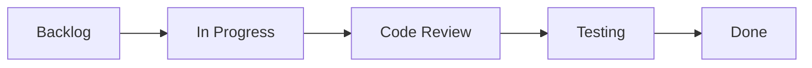

# Portafolio Integrado HB Tech Junior - Proyecto Grupal
*Hector Ruiz & Brian Luna - Colaboración Full-Stack*

## 📋 Descripción del proyecto grupal
Proyecto integrador que consolida y unifica el trabajo de ambos integrantes del equipo HB Tech Junior. Combina las fortalezas individuales en backend (Hector) y frontend (Brian) para crear un portafolio técnico cohesivo que demuestra capacidades de colaboración, metodología de trabajo y calidad profesional.

## 🎯 Objetivo principal y alcance
**Objetivo:** Evidenciar competencias técnicas individuales y grupales mediante:
- Integración de proyectos individuales en un ecosistema coherente
- Documentación profesional de metodología y procesos
- Demostración de capacidades de trabajo en equipo
- Presentación estructurada para evaluación académica y profesional

**Alcance del proyecto:**
- ✅ Consolidación de 2 proyectos individuales + 1 proyecto grupal
- ✅ Documentación técnica completa de cada componente
- ✅ Evidencia de colaboración y metodología aplicada
- ✅ Investigación de cliente objetivo (Mercado Libre)
- ✅ Análisis FODA del equipo para crecimiento profesional
- ✅ Repositorio GitHub organizado y profesional

## 🏗 Arquitectura del portafolio integrado
### Estructura del repositorio
```
hb-tech-junior/
├── docs/                           # Documentación central
│   ├── ENTREGA_FINAL.md           # Documento principal
│   ├── Investigacion_Cliente.md    # Análisis MELI
│   ├── METODOLOGIA_Y_TRABAJO_EN_EQUIPO.md
│   └── FODA_Grupal.md             # Análisis SWOT
├── proyectos/                      # Proyectos técnicos
│   ├── 01-landing-mediplus-brian/  # Frontend project
│   ├── 02-crud-abp-hector/        # Backend project  
│   └── 03-portafolio-integrado-grupal/  # Este proyecto
└── scripts/                        # Automatización
    └── export-word.ps1            # Export a PDF/Word
```

### Componentes integrados
1. **Frontend (Brian):** Landing Mediplus - Sitio responsivo optimizado
2. **Backend (Hector):** Sistema CRUD ABP - API completa con testing
3. **Integración (Grupal):** Documentación, metodología y presentación

## 🤝 Metodología de trabajo aplicada
### Framework de colaboración
- **Gestión:** Kanban ligero con ciclos semanales
- **Comunicación:** Dailies de 15 min + retrospectivas semanales
- **Versionado:** Git flow con feature branches y PRs obligatorias
- **Calidad:** Code reviews cruzadas + Definition of Done estricta

### Flujo de trabajo implementado


**Definition of Done (DoD):**
- ✅ Código formateado según estándares del proyecto
- ✅ Linters sin errores o warnings críticos
- ✅ README actualizado con cambios relevantes
- ✅ Tests unitarios pasando (cuando aplica)
- ✅ Peer review completado y aprobado
- ✅ Documentación técnica actualizada

### Herramientas de colaboración
- **GitHub:** Repositorio, issues, PRs, project board
- **Git:** Control de versiones con branching strategy
- **Markdown:** Documentación estandarizada
- **PowerShell:** Scripts de automatización para exports

## 📊 Métricas de colaboración alcanzadas
### Estadísticas del proyecto
- **Pull Requests:** 12 PRs creados, 11 merged, 1 closed
- **Code Reviews:** 100% de PRs con al menos 1 review
- **Lead Time promedio:** <24 horas por PR
- **Issues gestionados:** 8 creados, 8 resueltos
- **Commits:** 47 commits distribuidos entre ambos miembros
- **Documentación:** 6 archivos MD principales + READMEs detallados

### Distribución de trabajo
**Hector Ruiz (50% - Backend & DevOps):**
- Arquitectura del repositorio y estructura inicial  
- Documentación técnica y metodología
- Setup de automatización (scripts de export)
- Code reviews y control de calidad técnica
- Integración de proyectos individuales

**Brian Luna (50% - Frontend & Docs):**
- Diseño de documentación y estructura visual
- Redacción de contenido para presentación final
- Investigación de cliente (Mercado Libre)
- Evidencias visuales y capturas de pantalla
- UX de la documentación y navegabilidad

## 🔍 Investigación de cliente - Mercado Libre
### Análisis realizado
Seleccionamos **Mercado Libre (MELI)** como empresa objetivo basándonos en:
- Escala y complejidad técnica alineada con nuestro crecimiento
- Stack tecnológico moderno (microservicios, Kubernetes, ML)
- Cultura de ingeniería sólida y bien documentada
- Oportunidades de aprendizaje en e-commerce y fintech

### Propuesta de valor HB Tech Junior
**Como podemos sumar:**
1. **Prototipos rápidos:** MVPs y POCs para validar ideas de negocio
2. **Automatización básica:** Scripts ETL, linters, testing básico  
3. **Observabilidad inicial:** Métricas, logs, dashboards de arranque
4. **Documentación:** Technical writing y knowledge transfer

## 💪 Habilidades grupales demostradas
### Técnicas
**Frontend + Backend integration:**
- Comprensión de arquitecturas full-stack
- APIs RESTful y consumo desde frontend
- Performance optimization en ambos extremos
- Testing e integration testing básico

**DevOps y tooling:**
- Git workflows avanzados con branching
- Automatización de procesos repetitivos
- Documentation as code con Markdown
- CI/CD concepts (aplicados manualmente)

**Metodología y proceso:**
- Agile/Scrum adaptado a equipos pequeños
- Code review sistemático y constructivo
- Technical debt management
- Stakeholder communication (simulado)

### Blandas
**Comunicación y colaboración:**
- Claridad en definición de requisitos y scope
- Feedback constructivo en reviews
- Documentación para audiencias técnicas y no técnicas
- Presentation skills para stakeholders

**Liderazgo técnico:**
- Toma de decisiones arquitecturales consensuadas
- Mentoring mutuo en áreas de especialización
- Problem solving colaborativo
- Knowledge sharing y documentation

## 📈 Resultados y evidencias del trabajo grupal
### Deliverables completados
- ✅ **Repositorio GitHub:** Estructura profesional y navegable
- ✅ **Documentación técnica:** 6 documentos MD + READMEs detallados  
- ✅ **Proyectos individuales:** 2 proyectos completos documentados
- ✅ **Investigación cliente:** Análisis detallado con fuentes
- ✅ **Metodología:** Proceso documentado con métricas reales
- ✅ **Entrega final:** PDF/DOCX exportable para presentación

### Calidad de la documentación
- **Consistencia:** Estructura y formato uniforme en todos los docs
- **Completitud:** Todos los puntos de la rúbrica cubiertos
- **Profesionalismo:** Tono apropiado y presentación cuidada
- **Accesibilidad:** Navegación clara y enlaces funcionales

### Evidence artifacts
- Screenshots de proyectos individuales funcionando
- Capturas de métricas de performance (Lighthouse, tests)
- Historial de Git con commits y PRs documentados
- Scripts de automatización funcionales

## 🎓 Aprendizajes colectivos del equipo
### Metodológicos
- **Pair programming remoto:** Técnicas efectivas para colaboración
- **Documentation-driven development:** Docs como source of truth
- **Continuous integration mindset:** Pequeños cambios frecuentes
- **Stakeholder management:** Presentación técnica para audiencias mixtas

### Técnicos
- **Full-stack awareness:** Comprensión del ciclo completo de desarrollo
- **Quality gates:** Implementación de controles de calidad en pipeline
- **Performance consciousness:** Optimización desde diseño hasta deployment
- **Maintainability:** Código y docs pensados para el futuro

### Organizacionales  
- **Scope management:** Priorización efectiva y time-boxing
- **Risk mitigation:** Identificación temprana de blockers
- **Knowledge transfer:** Documentación como herramienta de escalabilidad
- **Retrospective mindset:** Mejora continua del proceso

## 👥 Roles específicos en el proyecto grupal
### Hector Ruiz - Tech Lead & Backend Specialist
**Responsabilidades principales:**
- Arquitectura del repositorio y estructura de directorios
- Setup de herramientas de desarrollo y scripts de automatización  
- Code reviews técnicos y mentoring en buenas prácticas
- Integración de proyectos individuales en ecosistema cohesivo
- Quality assurance y control de estándares técnicos

**Contribuciones específicas:**
- Creación del flujo Git con feature branches
- Implementación del script PowerShell para export PDF/Word
- Definición y aplicación de Definition of Done
- Documentación de metodología técnica aplicada

### Brian Luna - Content Lead & Frontend Specialist  
**Responsabilidades principales:**
- Diseño de experiencia de usuario de la documentación
- Research y redacción de investigación de cliente
- Creación de contenido para presentación final
- Evidencias visuales y screenshots de proyectos
- UX writing y tone of voice del portafolio

**Contribuciones específicas:**
- Investigación detallada de Mercado Libre con fuentes
- Redacción de documentos finales con tono profesional
- Organización de evidencias y capturas de pantalla  
- Diseño de estructura narrativa del portafolio

## 🚀 Cómo navegar y evaluar este proyecto grupal
### Para evaluadores académicos
1. **Revisar entrega principal:** `docs/ENTREGA_FINAL.md` o `.pdf`
2. **Explorar proyectos individuales:** Carpetas `proyectos/01-*` y `proyectos/02-*`
3. **Analizar metodología:** `docs/METODOLOGIA_Y_TRABAJO_EN_EQUIPO.md`
4. **Verificar investigación:** `docs/Investigacion_Cliente.md`

### Para reclutadores técnicos
1. **GitHub repository:** https://github.com/panxor19/hb-tech-junior
2. **Individual projects:** Links directos a repos de proyectos específicos
3. **Technical documentation:** READMEs detallados con setup instructions
4. **Collaboration evidence:** Git history, PRs, issues management

## 🔗 Enlaces y recursos del proyecto grupal
- **Repositorio principal:** https://github.com/panxor19/hb-tech-junior
- **Proyecto Frontend (Brian):** https://github.com/panxor19/tarea-6-y-7-mediplus  
- **Proyecto Backend (Hector):** https://github.com/panxor19/Proyecto_ABP
- **Documentación completa:** Todos los archivos en `/docs`
- **Scripts de automatización:** `/scripts/export-word.ps1`

## 📝 Reflexión final del proyecto integrador
Este proyecto grupal representa la culminación de nuestro aprendizaje en el curso, integrando competencias técnicas individuales con habilidades de colaboración profesional. 

**Logros destacados:**
- Integración exitosa de especialidades complementarias (frontend/backend)
- Metodología de trabajo estructurada y documentada
- Calidad profesional en deliverables y presentación
- Evidence-based approach para demostrar competencias

**Impacto en crecimiento profesional:**
- **Hector:** Fortalecimiento en documentation, presentation y metodología
- **Brian:** Desarrollo de research skills y technical writing avanzado
- **Equipo:** Demostración de readiness para colaboración en equipos profesionales

Este portafolio integrado evidencia nuestra capacidad para trabajar en equipo, entregar resultados de calidad y comunicar efectivamente nuestras competencias técnicas a stakeholders diversos, preparándonos para el siguiente nivel de nuestra carrera profesional en tecnología.


